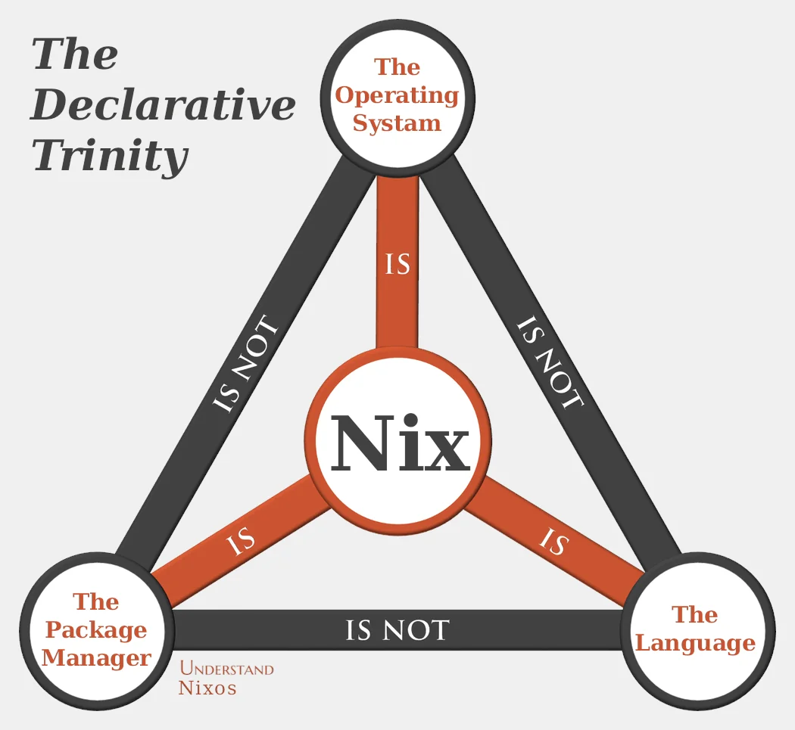
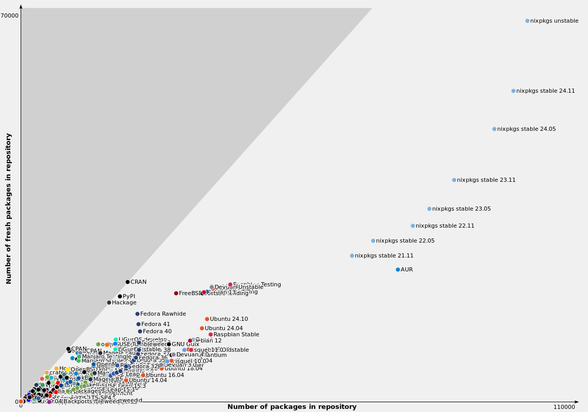

# What is Nix?

Nix community is _definetly_ not very good in naming things. It means a lot of things:

1. A fully functional, lazly evaluated language which creates something called *derivation*
2. A package manager like npm, apt.
3. A method of compiling software, almost like a build system.

The confusion also stems from the fact that the interpreter that interprets the nix language is also called `nix`, while the package manager + all the other tools provided by nix community is a sub-command to the umbrella `nix` command.




<!-- end_slide -->

# What does Nix achieve?

## Infrastructure as Code

Infrastructure as code (IaC) is the process of managing and provisioning computer data center resources through machine-readable definition files, rather than physical hardware configuration or interactive configuration tools. The IT infrastructure managed by this process comprises both physical equipment, such as bare-metal servers, as well as virtual machines, and associated configuration resources. [1]

## Reproducibilty

Compiling from the same source on independent infrastructure yields bit-by-bit identical results, which gives the ultimate confidence on couple on things:

1. If it "works on my machine" it will work on yours too.
2. The inverse of the 1st point is also true.
3. Exact behaviour between CI and local.
4. A way to verify if a given artifact indeed comes from a specific source

## Software Supply Chain Security

Since derivations of a package is fully deterministic and can be examined easily for given nix package, we are controlling the "dependency hell" better to a point that provides some supply chain security*.


> * There is an anti-thesis to this which will be discussed in the previous slides due to the fact that nixpkgs, the largest open source package repo in existence, has more than 5k contributors and not throughly vetted as a result.

<!-- end_slide -->

# Nixpkgs

It is a repo on GitHub, contains more than 120000 package.

Lots of bots are updating the packages automatically. Automation is very high, as high as it is very common for people to chat with bots in IRC channels without realizing.



[2] Fresh package vs total package: Image taken from https://repology.org

<!-- end_slide -->

# Language Demo

Here is a really simple couple of examples of nix programs. Notable features of the language is that:

1. Purely functional.
2. Lazy evaluation.
3. Declarative rather than imperative: things are defined as expressions rather than sequence of "events".
4. Everything is an expression, no side effects.

## Example 1: Attribute Set

```nix
{
 x = [ "y" ];
 y = 1;
 z = 1 + 1;
}
```
<!-- end_slide -->

```bash
$ nix eval -f ./examples/abstract.nix x

> ["y"]
```
<!-- end_slide -->

```bash
$ nix eval -f ./examples/abstract.nix y

> 1
```
<!-- end_slide -->

```bash
$ nix eval -f ./examples/abstract.nix z

> 2
```
<!-- end_slide -->

## Example 2: A basic example to use nix to build hello-world from GNU

```nix
let
 pkgs = import <nixpkgs> {};
in
pkgs.stdenv.mkDerivation {
 name = "hello-world";
 src = builtins.fetchTarball {
  url = "https://ftp.gnu.org/gnu/hello/hello-2.10.tar.gz";
  sha256 = "1im1gg1fm4k10bh4mdaqzmx313kivnsmxrv16vymfqqz1jq751";
 };
}
```

```bash
$ nix build -f ./examples/hello-world.nix
$ ls -lah result/bin
> total 22K
  dr-xr-xr-x 2 root root   3 Jan 1 1970 .
  dr-xr-xr-x 2 root root   4 Jan 1 1970 ..
  -r-xr-xr-x 1 root root 37K Jan 1 1970 hello

$ file result/bin/hello
> result/bin/hello: ELF 64-bit LSB executable, x86-64, version 1 (SYSV), dynamically linked, interpreter /nix/store/k5r6p8gvf18l9dd9kq1r22ddf7hello-2-10.nix

$ result/bin/hello
> Hello, World!
```

<!-- end_slide -->

## Example 3: Nix as a system configuration tool: NixOS


# Nix Store

Every derivation goes to the nix store generally mounted as `/nix` drive in the user system. Since any derivation is cached here, it is much faster to execute them again without needing to rebuild all the derivation from scratch. But if space is an issue, nix offers a garbage collector to gc untouched derivations in *x* days.

```sh
$ ls /nix/store
>
 zz5m30v3d3fgf3yd0i8wn95f9v1nbgxr-aws-c-common-0.9.27
 zz7cw711lbc09wjawdnpk9q4x15g53mq-blueman-applet.service
 zzag7haj238s1z9qd2180gk504vmmzka-unliftio-0.2.25.0.drv
 zzajzhi1r5fclrzl24svzzwajc9i811q-libb2-0.98.1.drv
 zzfzw8lmmscpxmcf97k39kds0rjpym64-fuel-core-types-0.41.0.drv
 zzhry5d4wgk0zlfyhl8bmz2jq9hbdpxd-hyper-rustls-0.23.2.drv
 zzij1p46h7cw6fgczgr6mcsb5sh22kl7-policies.json.drv
 zzjyg9009z7rbfckcly7ns0vji7497xq-wrap-gapps-hook.drv
 zzk5c7s8pnavkzyb516xcbmqs48pxsml-pkg-config-0.29.2.drv
 zzl7rdi2jpcqawhlavfvy10yingxn32r-terminal-size-0.3.4-r1.cabal.drv
 zzl8vbk6q02xzsfc401c7k0vfbz9i60s-hycolor-1.10-tex.drv
 zzmhn4zf6g3xl57g51iinq2bdk3k5dir-crate-ucd-trie-0.1.7.tar.gz.drv
 zzn64c20m4ipzkciv0cga8x5bm8n7b50-kwayland-5.116.0
 zzp4baqlwl7d78p1qlvvpsaj6z31fmh4-zlib-0.6.3.0.tar.gz.drv
 zzp8y5y5nnyw10c77qiksz7wlxi1zn1y-vulkan-headers-1.4.304.0.drv
 zzpq4rrv5117rn73jml2a39vccjjs67z-git-2.47.2.drv
 zzr6k9i3zln62npsf4bvc1ymfry1f3fq-colorprofiles-20181105-tex.drv
 zzrcrcbs6cxrmg1yi09livjr9ggckm75-libzip-1.11.2.drv
 zzsy0gfxj2ywlvrz8sxijnxn4d8jvwni-libksysguard-6.3.
 .
 .
 .
```

<!-- end_slide -->

# A common question: Nix vs Docker

The main difference is *docker* is repeatable but not reproducible, while *nix* is reproducible and deterministic?

Remember the compiling of hello world example using nix, now let's do the same thing with a Dockerfile.

```bash
FROM ubuntu:latest
    # ^^^^^^^^^^^^<- Latest when? When I run `docker build`?
    #      ^
    # Ubuntu layer is not intrinsically attached to a source
    # where is the Dockerfile for it?
RUN apt-get update && apt-get install hello -y
  # ^^^^^^^^^^^^^^    ^^^^^^^^^^^^^^^^^^^^^<---- Doesn't compile from source
  # Will resolve to different package list
  # every time, some packages might disappear
CMD [ "hello" ]
# ^^^^^^^^^^^^^ Assumes the `hello` package puts `hello` binary on the $PATH, which may change
```

Dockerfiles and what they describe is intrinsically detached from each other, which is not the case for nix derivations, a nix code is always going to produce the same derivation and %99.9 of the time same binary (exceptions apply).

```bash
$ docker save $(docker build --no-cache -q .) -o foo1.tar
$ docker save $(docker build --no-cache -q .) -o foo2.tar
$ ls -lah foo*
> 3a444da... foo1.tar
  9b66f2b... foo2.tar
```

> There is a little hack here as tar itself is not deterministic and timestamps have an effect.

<!-- end_slide -->

# Example 3: nix-repl and derivations: Isolation without containers


```sh
nix-repl> :l <nixpkgs> # load nixpkgs
Added 23797 variables.

nix-repl> python3 # get the derivation for python3
«derivation /nix/store/jqjl1pjb8h7v15ip3am81yj9ff8xw9bh-python3-3.12.8.drv»

nix-repl> python3.withPackages (p : [ p.numpy ]) # get a derivation for a system with python3 + numpy which is different from the first one.
«derivation /nix/store/mmiscyz3x4sqql8ikgmiswy1jh00yih1-python3-3.12.8-env.drv»

nix-repl> :b python3.withPackages(p: [p.numpy]) # build with numpy

This derivation produced the following outputs:
  out -> /nix/store/lppyzcz5qywrb0j527a3ca1yyrr2mfy9-python3-3.12.8-env

nix-repl> :b python3 # build without numpy

This derivation produced the following outputs:
  debug -> /nix/store/fxx2zijvbblhwh96awf50jvw5padmdfy-python3-3.12.8-debug
  out -> /nix/store/0l539chjmcq5kdd43j6dgdjky4sjl7hl-python3-3.12.8

$ /nix/store/lppyzcz5qywrb0j527a3ca1yyrr2mfy9-python3-3.12.8-env/bin/python3
Python 3.12.8 (main, Dec  3 2024, 18:42:41) [GCC 14.2.1 20241116] on linux
Type "help", "copyright", "credits" or "license" for more information.
>>> import numpy
>>>

$ /nix/store/0l539chjmcq5kdd43j6dgdjky4sjl7hl-python3-3.12.8/bin/python3
Python 3.12.8 (main, Dec  3 2024, 18:42:41) [GCC 14.2.1 20241116] on linux
Type "help", "copyright", "credits" or "license" for more information.
>>> import numpy
Traceback (most recent call last):
  File "<stdin>", line 1, in <module>
ModuleNotFoundError: No module named 'numpy'
```
<!-- end_slide -->

# Nix Flakes

A `flake.nix` file is an attribute set with two attributes called `inputs` and `outputs`. The inputs attribute describes the other flakes that we would like to use; things like `nixpkgs` or `home-manager`. We have to give it the url where the code for that other flake is, and usually people use GitHub. The outputs attribute is a function, which is where we really start getting into the nix programming language. Nix will go and fetch all the inputs, load up their `flake.nix` files, and it will call your outputs function with all of their outputs as arguments. The outputs of a flake are just whatever its outputs function returns, which can be basically anything the flake wants it to be. Finally, nix records exactly which revision was fetched from GitHub in `flake.lock` so that the versions of all your inputs are pinned to the same thing until you manually update the lock file. 

Flakes are the now defacto way of using nix. Everything can be defined as a series of flakes, from the all system configuration and packages availble on your system, to simply wrapping a project. As an example we can take a look at the `flake.nix` for this slide set.

A flake can have multiple output. An output of a flake might be an executable, a library, or a shell. It is possible and a common practice to have multiple outputs for a single `flake.nix` especially while working on projects. One output would be the build artifact of the project, the other can be a development shell which gives a perfectly reproducible environment that gives all the necessary tools to work on that same project (imagine writing a cli tool, one output would be the cli tool itself, another would be `devShell` once evaluated gives an environment with local text editor such as vim with set of configurations pre-configured, an lsp, the compiler of the language, the dependencies of the project etc.).

As it can be seen from the examples, nix flakes actually do everything a docker container is doing except the virtualization. Everything is isolated yet still running natively without a docker deamon running in the background. They are very nice tools to switch between environments that do not collide, and easily reproducible across devices making working on multiple projects very hassle free. That being said nix is very different in nearly everything it does. It is a weird package manager, different language, declaritve way of deriving things is not very straightforward for most people. So the learning curve is there!

<!-- end_slide -->

# Together stronger: Nix + Docker

Nix is nice but learning curve is very steep! Basically everything needs to be done manually, which in return gives us almost perfect reprodubility (there are some areas of concerns such as the Java compiler). Although they have big flaws we have a reality to face: "World is running on docker".

Some community members are more strict in the sense that they want to separate nix from docker completly as they are actually for different things. But some thinks a more wide adoptation will come if nix plays nice with de-facto way of doing things which is Docker. So the second camp offers some nix functions that builds docker containers using nix and effectively making nix a better docker container builder than docker itself.

```sh
$ cat flake.nx
>
{
 inputs.nixpkgs.url = "github:nixos/nixpkgs/nixos-22-05";
 outputs = { self, nixpkgs };
  let
   pkgs = nixpkgs.legacyPackages.x86_64-linux;
  in
  {
   my-container-image = pkgs.dockerTools.buildLayeredImage {
    name = "my-container-image";
    tag = "latest";
    contents = [
     pkgs.hello
    ];
    config.Cmd = [ "hello" ];
   };
  };
}
```

Since this is a flake, a `flake.lock` will be generated and thus latest will be the samething until the user runs nix flake update explicitly, solving issues with the Dockerfile way of building docker containers.

<!-- end_slide -->

# Example 4: Cross compile using Nix

Cross compilation is generally problematic and need special care in most cases. Nix makes it easier through a function called `pkgsCross`

```bash
$ nix build nixpkgs#pkgsCross.riscv64.hello -L
> 
 ...
 hello-riscv64-unknown-linux-gnu> gzipping man pages under /nix/store/jnib1f5z0q1adp29yskrw24xas7532xc-hello-riscv64-unknown-linux-gnu-2.12.1/share/man/
 hello-riscv64-unknown-linux-gnu> patching script interpreter paths in /nix/store/jnib1f5z0q1adp29yskrw24xas7532xc-hello-riscv64-unknown-linux-gnu-2.12.1
 hello-riscv64-unknown-linux-gnu> stripping (with command riscv64-unknown-linux-gnu-strip and flags -S -p) in  /nix/store/jnib1f5z0q1adp29yskrw24xas7532xc-hello-riscv64-unknown-linux-gnu-2.12.1/bin
```

<!-- end_slide -->

# Example 5: `nix-shell`: trying before buying

No global state changes means temporary environments are very easy to achieve. If you only need to try something and do not polute your system `$PATH`, `nix-shell -p <PACKAGE_NAME>` is available.


```bash
$ file
> file: command not found
$ nix-shell -p file
> Usage: file [-bcCdEhikLlNnprsSvzZ0] [--apple] [--extension] [--mime-encoding]
            [--mime-type] [-e <testname>] [-F <separator>]  [-f <namefile>]
            [-m <magicfiles>] [-P <parameter=value>] [--exclude-quiet]
            <file> ...
       file -C [-m <magicfiles>]
       file [--help]
```

<!-- end_slide -->
# Reference

[1]  Wikipedia contributors. (2024, November 12). Infrastructure as code. Wikipedia. https://en.wikipedia.org/wiki/Infrastructure_as_code

[2]  Marakasov, D. (n.d.). Repository statistics - Repology. https://repology.org/repositories/statistics/total
